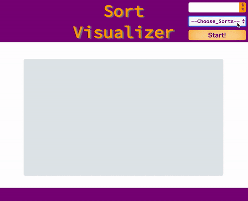
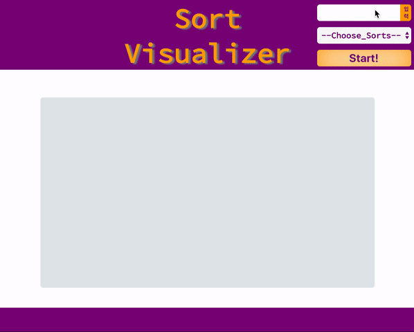
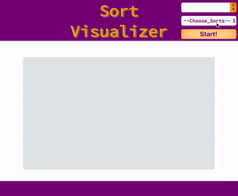
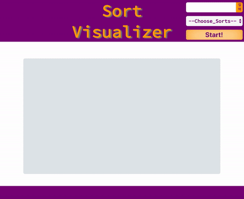

# Vanilla Sorting

4가지 정렬 알고리즘의 구동 방식을 웹으로 표현해주는 프로그램을 구현했습니다.


[Bubble Sort]




[Insertion Sort]




[Merge Sort]




[Selection Sort]




## Setup

Install dependencies

```sh
$ yarn install (or npm install)
```

## Development

```sh
$ yarn dev (or npm run dev)
# visit http://localhost:8080
```

## Description

4가지 정렬 알고리즘의 구동 방식을 시각적으로 확인할 수 있도록 표현했습니다.

* 사용자는 우측 상단의 input창에 숫자를 입력할 수 있습니다.
* 숫자들을 입력한 후, 사용자가 원하는 정렬 방식을 선택할 수 있습니다.
* 정렬 방식을 선택한 후, 실행할 수 있는 "실행" 버튼을 클릭합니다.


## Challenges & Things to do


- 정렬 알고리즘을 사용자에게 시각화하여 보여주는 과제였기 때문에 처음 접해보는 정렬 알고리즘을 정확하게 이해하기 위해 노력했습니다.

- Merge Sort의 구현이 까다로워 2-3일 정도의 시간이 할애되었는데 끝까지 포기하지 않고 문제를 해결해낸 경험이 귀중한 경험으로 기억됩니다.

- 같은 문제를 해결함에 있어 동기들이 각자 다른 방식의 해결 방법을 가지고 해결하는 것이 신기했고, 그것을 공유하고 토론하는 것이 즐거웠습니다. 그러던 중 동기 한 명이 queue 구조를 접목해 문제를 해결하는 모습에 감탄했고 Merge Sort에서는 이전에 접근했던 방식이 아닌 queue 구조를 접목하여 코드 가독성과 유지 보수의 용이함을 높였습니다. 스스로 고민하는 시간, 그리고 그것들을 동료들과 공유하고 발전시켜나가는 것의 즐거움을 배웠습니다.

- 일주일이라는 시간 안에 완성해야 하는 과제였기 때문에 기능 구현을 우선순위에 두었습니다. performance를 충분히 고려하지 못하였던 것이 아쉬움으로 남습니다.


### Reference

1. 시간복잡도: [Big-O Cheatsheet](http://bigocheatsheet.com/))
2. [Bubble Sort](https://en.wikipedia.org/wiki/Bubble_sort)
3. [Insertion Sort](https://en.wikipedia.org/wiki/Insertion_sort)
4. [Merge Sort](https://en.wikipedia.org/wiki/Merge_sort)
5. [Selection Sort](https://en.wikipedia.org/wiki/Selection_sort)
